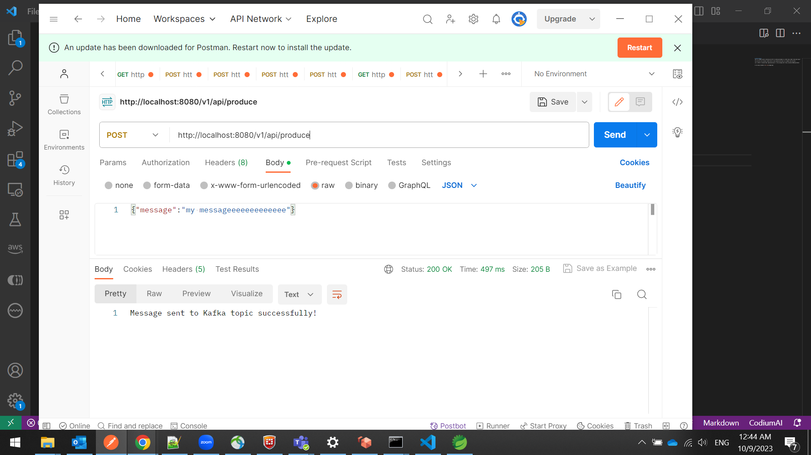

# kafka-producer
This is a sample project containing one API for producing messages on a kafka topic named "subscriber-topic"

You can test it by the below steps :

1- Run a kafka server on your machine 

2- Run maven install command on the project folder : mvn install 

3- Go inside the generated target folder and run "java -jar spring-boot-web-app-1.0.0.jar" command in a cmd file.

4- After starting the project use a curl command like the below : 

curl -X POST -H "Content-Type: application/json" -d "Your message here" http://localhost:8080/api/produce

or by using a postman like this sample 

Project created by Mohamed Shawky just for a sample.